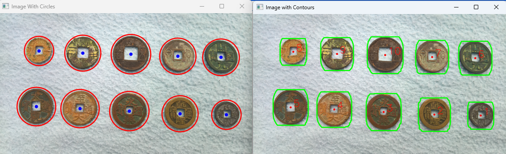

# Coin Detection and Analysis Using OpenCV

This Python script detects and analyzes coins in an image using a series of image processing techniques and OpenCV functionalities. The program identifies coins, counts them, extracts contours, and displays results visually, such as connected components and filtered contours.

---

## Features

1. **Grayscale Conversion**  
   - Converts the input image to grayscale for preprocessing.

2. **Thresholding for Channel Separation**  
   - Splits the image into Red, Green, and Blue channels.
   - Applies binary thresholding to separate coin regions.

3. **Morphological Operations**  
   - Removes noise and enhances coin shapes using erosion, dilation, opening, and closing operations with various kernels.

4. **Blob Detection**  
   - Detects circular objects (coins) using OpenCV's `SimpleBlobDetector`.

5. **Connected Components Analysis**  
   - Identifies and visualizes connected components to highlight individual coins.

6. **Contour Detection**  
   - Extracts and draws contours of the coins.
   - Filters contours based on area to exclude unwanted regions.

7. **Visualization**  
   - Displays intermediate and final results using both OpenCV windows and Matplotlib.

---

### **Usage**

1.**Run the script:**
`python coin-detection.py`
